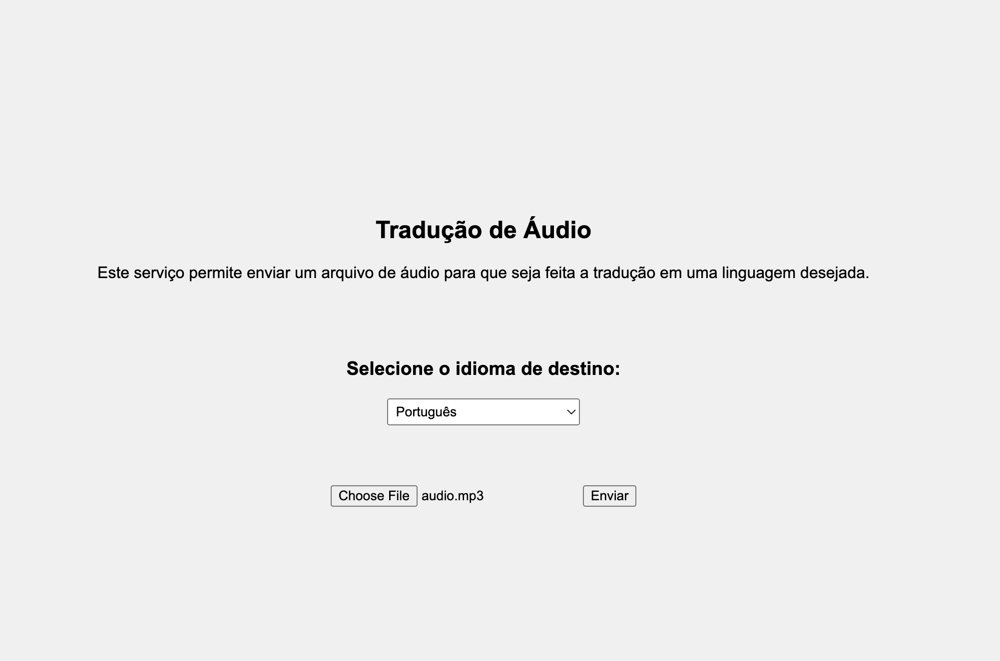

# Aplicativo React de Tradução de Áudio com Backend FastAPI

Este é um aplicativo React que se conecta a um backend em FastAPI para traduzir áudio em diferentes idiomas. O aplicativo permite que os usuários façam o upload de arquivos de áudio, escolham o idioma de destino e recebam o arquivo de áudio traduzido.

## Funcionalidades

- Faça o upload de arquivos de áudio.
- Escolha o idioma de destino para a tradução.
- Receba o arquivo de áudio traduzido.
- Acompanhe o progresso da tradução.

## Pré-requisitos

- Node.js e npm instalados.
- Docker instalado para o backend FastAPI.

## Forma de uso

- Execute os dois dockerfiles ou então localmente.
- o react vai abrir uma tela para que seja feita o uploado do audio e a escolha da linguagem
  

